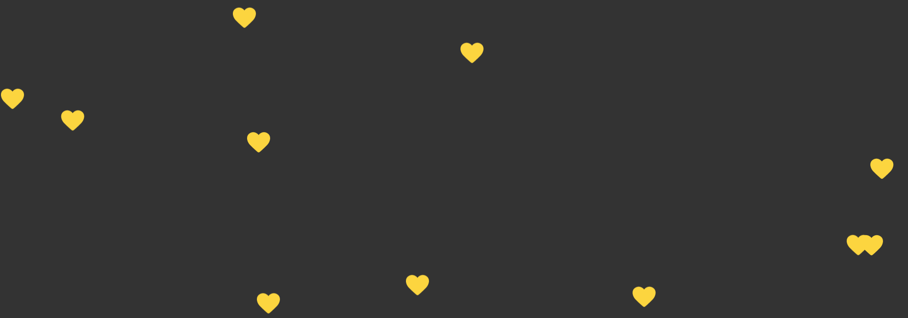
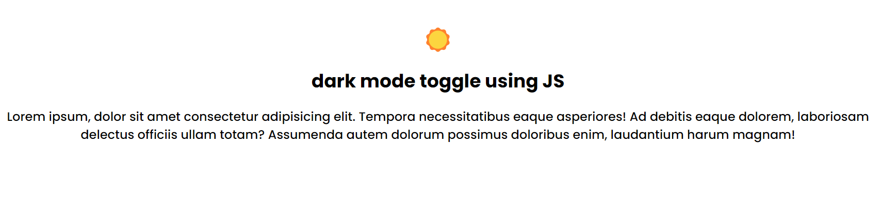

# js-mini_projects
# 01 hamburger with js on click and toggle function
after clicking this menu button it will open a menu item along with a change in icon X.

# 02 Toast Notification when you click a button
when you click a button a toast notification will appear and disappear in couple of seconds..

# 03 auto write text using js
when you click a button a popup box will appear with a heading, text and and a close button...

# 04 popup box when you click the button

#  05 heart rain using js 

# 06 change a background color when you click a button!!

# 07 dark mode toggle 
